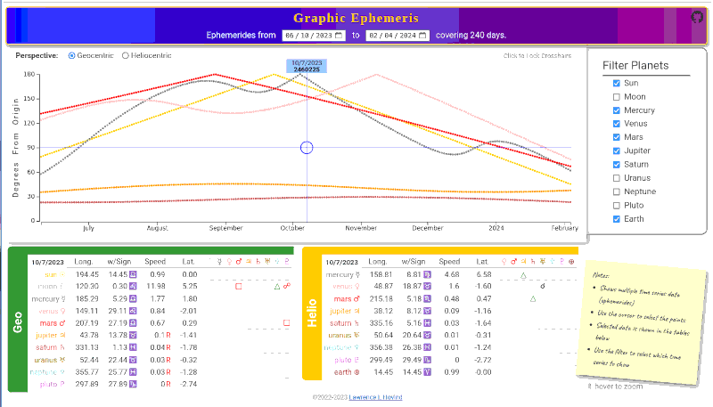

# Graphic Ephemeris

What is an Ephemeris?

According to [Dictionary.com](https://www.dictionary.com/browse/ephemeris) it is:

> 1. a table showing the positions of a heavenly body on a number of dates in a regular sequence.
>
> 2. an astronomical almanac containing such tables.

---

## What is the 'Graphic Ephemeris' ?



It is a D3.js in Vue.js+Pinia Demonstration program. It shows time series data (ephemerides) in a visual display along with a tabular format and analysis. 

> Have a look at the [**LIVE DEMO**](http://www.hovind.com/demos/graphic-ephemeris)

The D3 graph presents two selectable perspectives of the data, and a lockable tracking crosshair which selects data points to be displayed in the tables. Utilizing a Resize Observer the graph will resize as the window resizes. (see Best Viewing below)

The code for this Demo uses the Vue3 Composition API. It demonstrates Components and their reuse, as well as reactivity between loosely coupled components via a Pinia store. The Pinia store retrieves the time series data from an API and provides functions to calculate the Aspects of the data.

The demo also includes User inputs for Dates, check boxes, and radio buttons. Again, demonstrating the reactivity between User controls and D3.

No CSS framework/library was incorporated, but a little CSS fun was thrown in for good measure.

## Best viewing
This is a busy frontend, packed with lots of information, and as such doesn't fit well in a small screen. You should have a window of 1400 x 800 or larger to view this demo properly. YMMV

### Additional Requirements

In addition to this project, you will also need an Ephemeris API. Fortunately, one can easily be found here: <https://github.com/llhovind/ephemeris-api>
  <br>
  <br>
## Project Setup

```sh
npm install
```

### Compile and Hot-Reload for Development

```sh
npm run dev
```

### Compile and Minify for Production

```sh
npm run build
```
